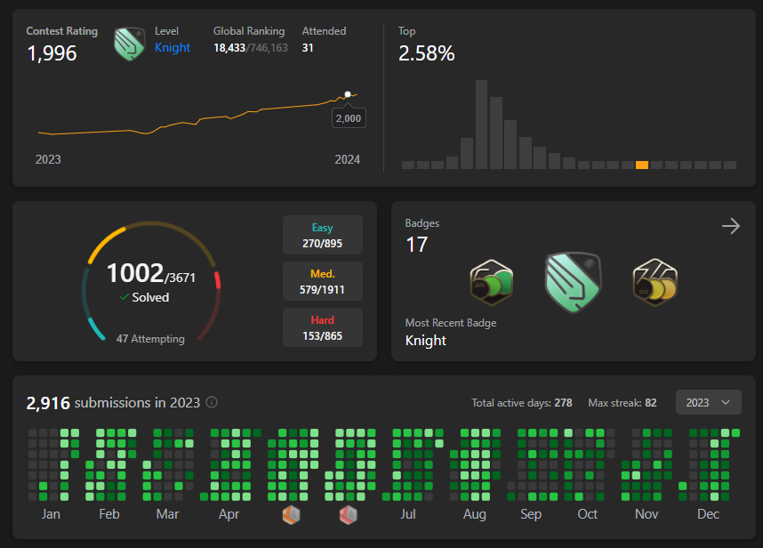

<h1 align="center">Hi 👋, I'm Siva Sankar</h1>

<h3 align="center">Building scalable systems that optimize real-world workflows.</h3>

### 🌐 Links & Contact

- ✉️ [Email](mailto:birijepallisiva@gmail.com)
- 🔗 [LinkedIn](https://linkedin.com/in/sivasankarbirijepalli)  
- 💻 [LeetCode](https://www.leetcode.com/megurubachira)  

---

### 🚀 About Me  
Results-driven **Software Developer** with a solid foundation in building **scalable, secure, and high-performance applications**.  

- 💼 Over **1 year of experience** in backend and full-stack development.  
- 🏗️ Contributed to the development of an **NFC-enabled forklift access system** at **KION India** using **Java + Spring Boot**, significantly enhancing operational efficiency and security.  
- 💡 Strong foundation in **Data Structures, Algorithms, and System Design** (Design Patterns, LLD).  
- 🌟 Passionate about leveraging innovative technologies to build **scalable solutions** that address real-world challenges and drive business impact.  

---

<h3 align="left">Languages and Tools:</h3>

                                   

---

### 🛠️ Technical Skills  

- **Languages:** Java, Python, C, C++, JavaScript, TypeScript, HTML, CSS, SQL, Linux, Unix Shell Scripting  
- **Developer Tools:** VS Code, Eclipse, Android Studio, Git, GitHub  
- **Technologies/Frameworks:** React JS, Redux, FAST API, Spring Boot  

---

### 🏆 Achievements  

  

- 🥇 **LeetCode**: Badge – *Knight* | Contest Rating – *2000* | Problems Solved – *1000+*  
- 🌟 **Star of the Sprint Award (x2)** – [KION GROUP] 

---

  

